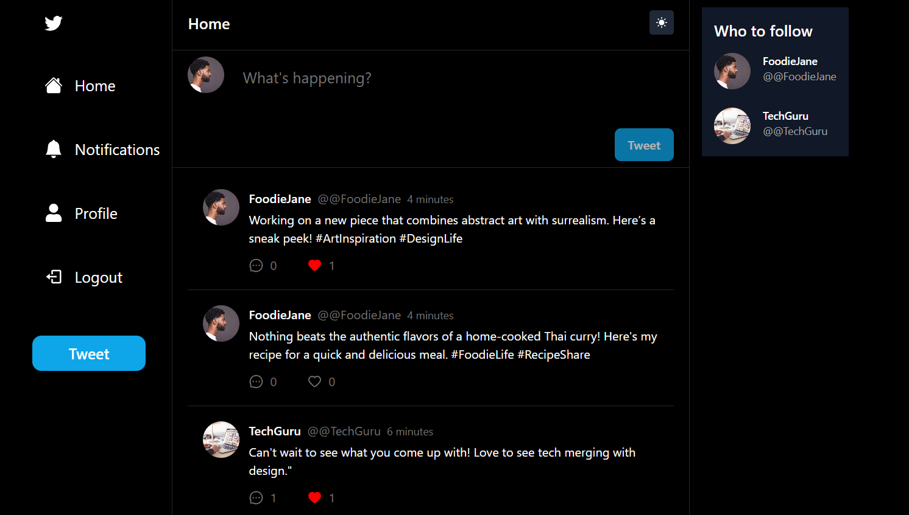
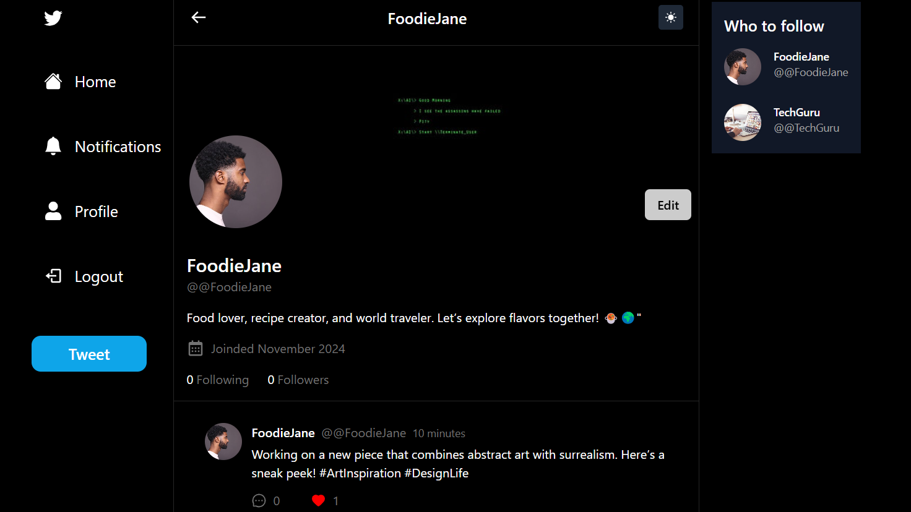
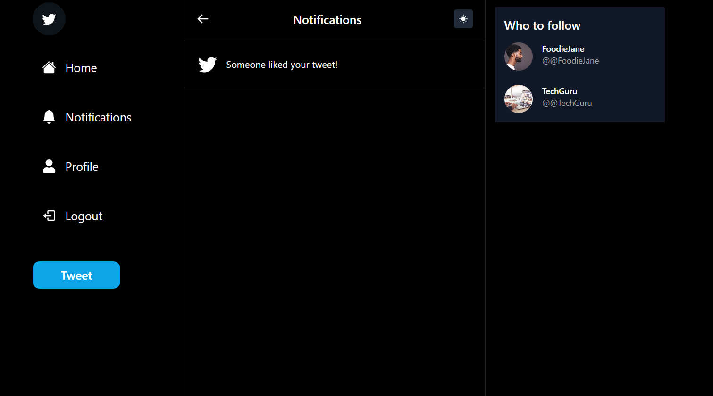
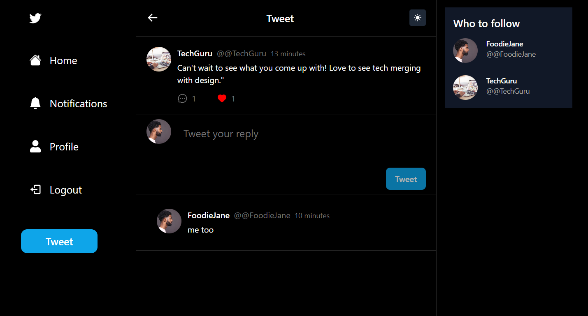
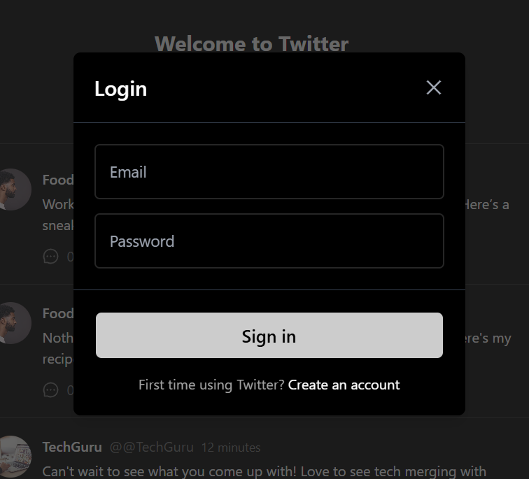
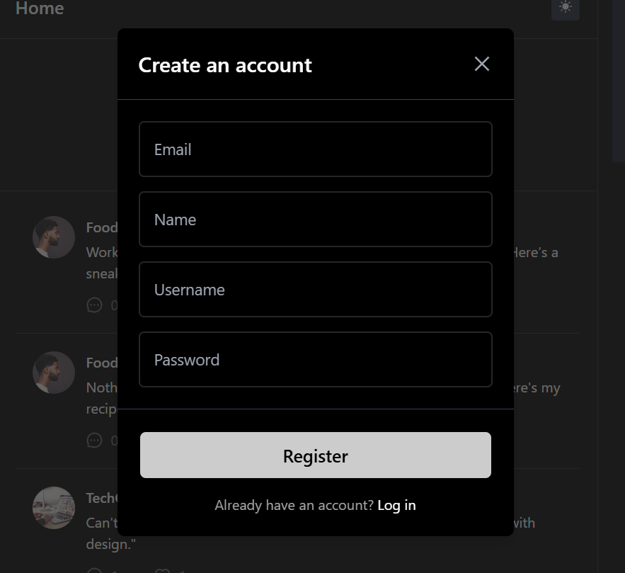

# Twitter Clone App
This is a full-featured Twitter clone app built with modern web development tools and technologies. It mimics the core features of Twitter, including user authentication, posting tweets, notifications, profiles, and more.

---
# Screenshots

### Home Page
- **Description**: "The main feed where users can see posts from people they follow, interact with content, and stay updated on the latest tweets."
- **Image**: 

### Profile Page
- **Description**: "User's personal profile page displaying their tweets, followers, and other profile details."
- **Image**: 

### Notifications Page
- **Description**: "The notifications section shows alerts about new followers, likes, retweets, and mentions."
- **Image**: 

### Comment Page
- **Description**: "The comment page where users can view and reply to comments on a particular post."
- **Image**: 

### Login Page
- **Description**: "The login page where users can enter their credentials to access their accounts."
- **Image**: 

### Register Page
- **Description**: "The registration page for new users to create an account and join the platform."
- **Image**: 

## Features

- User authentication with **Next-Auth**
- API calls and data fetching with **SWR** and **Axios**
- State management with **Zustand**
- Responsive design using **Tailwind CSS**
- Database management with **MongoDB** and **Prisma**
- Security with **Bcrypt** for password hashing

## Tech Stack

- **Framework**: [Next.js](https://nextjs.org/)
- **Frontend**: React, Tailwind CSS
- **Backend**: Next.js API routes
- **Database**: MongoDB (with Prisma ORM)
- **Authentication**: Next-Auth
- **State Management**: Zustand
- **Other Libraries**: SWR, Axios, TypeScript, Bcrypt, React Icons

